# Solana Tokenized Vault (ERC-4626)

[](https://opensource.org/licenses/MIT)
[](https://www.anchor-lang.com/)
[](https://solana.com/)

## Overview
A production-ready Solana implementation of the [ERC-4626 Tokenized Vault Standard](https://ethereum.org/developers/docs/standards/tokens/erc-4626/). This program unifies the technical parameters of yield-bearing vaults on Solana, offering a standardized interface where shares represent proportional ownership of underlying SPL tokens.

### Features
- **ERC-4626 Compliant**: Full implementation of Deposit, Mint, Withdraw, Redeem.
- **Inflation Attack Protected**: Implements [OpenZeppelin's virtual offset](https://docs.openzeppelin.com/contracts/5.x/erc4626#security-concern-inflation-attack) mechanism.
- **High Precision**: Uses 9-decimal internal accounting regardless of asset decimals.
- **Secure Architecture**: Built with Anchor, using PDA authorities and Token-2022.

---

## 📚 Table of Contents
- [1. Architecture & Design](#1-architecture--design)
- [2. Setup & Initialization](#2-setup--initialization)
- [3. Core Interactions (Write API)](#3-core-interactions-write-api)
- [4. Simulation & Views (Read API)](#4-simulation--views-read-api)
- [5. Sequence Diagrams](#5-sequence-diagrams)
- [6. Development](#6-development)

---

## 1. Architecture & Design

### Virtual Offset Protection
To prevent the "Inflation Attack" (where attackers manipulate exchange rates by donating assets to an empty vault), this vault uses a **virtual shares/assets** system.

$$Shares = \frac{Assets \times (TotalShares + 10^{\text{offset}})}{TotalAssets + 1}$$

#### Why `offsetDecimals`?
We normalize precision to ensure granular share distribution even for low-decimal assets.
- **Formula**: `offsetDecimals = 9 - assetDecimals`
- **Example (USDC, 6 decimals)**: Offset = 3. Virtual Shares = $10^3 = 1000$.
- **Example (SOL, 9 decimals)**: Offset = 0. Virtual Shares = $10^0 = 1$.

This ensures the vault always operates with at least **9 decimals of precision** internally.

---

## 2. Setup & Initialization

Before using the vault, the program must be initialized. This one-time process sets up the global configuration, creates the Vault Token (Shares Mint), and establishes the Asset Vault.

### Configuration Parameters

| Parameter | Type | Description |
| :--- | :--- | :--- |
| `name` | String | Name of the Shares Token (e.g., "Solana Yield Token") |
| `symbol` | String | Symbol of the Shares Token (e.g., "vSOL") |
| `uri` | String | URI pointing to off-chain metadata (JSON) for the token |

### On-Chain Architecture (PDAs)

Initialization creates critical Program Derived Addresses (PDAs) to manage state and assets securely without a private key.

| Account | Seeds | Description |
| :--- | :--- | :--- |
| **Config** | `["config"]` | Stores global vault state and references. |
| **Shares Mint** | `["shares_mint"]` | The Token-2022 mint for LP tokens. **Authority is itself** (PDA). <br/>*Decimals: 9 (MAX_DECIMALS)* |
| **Asset Vault** | *(ATA Mechanism)* | A standard Associated Token Account owned by the **Shares Mint**. <br/>*Holds all locked assets.* |
| **Access** | `["access", owner]` | Stores admin permissions/roles for the initializer. |

### Initialization Example

```typescript
import { TOKEN_PROGRAM_ID } from "@solana/spl-token";

// 1. Prepare underlying asset (e.g., USDC Mint)
const usdcMint = /* ... */;

// 2. Initialize Program & Vault
await program.methods
  .initialize({
    name: 'Magic USDC Vault',
    symbol: 'mUSDC',
    uri: 'https://arweave.net/metadata.json',
  })
  .accounts({
    owner: provider.wallet.publicKey, // Admin
    assetMint: usdcMint.publicKey,    // Underlying Asset
    assetTokenProgram: TOKEN_PROGRAM_ID,
    // PDAs (config, sharesMint, etc.) are automatically resolved by Anchor
  })
  .rpc();

console.log("Vault Initialized! Asset Vault is ready to receive deposits.");
```

---

## 3. Core Interactions (Write API)

The vault supports 4 atomic operations divided into Entry (Deposit/Mint) and Exit (Withdraw/Redeem) flows.

### API Reference

| Operation | Type | Input (Param) | Output (Effect) | Rounding | Description |
| :--- | :---: | :--- | :--- | :---: | :--- |
| **`deposit`** | Entry | `assets` (u64) | Mints calculated `shares` | ⬇️ Down | User deposits exact assets, gets shares. Favors Vault. |
| **`mint`** | Entry | `shares` (u64) | Transfers calculated `assets` | ⬆️ Up | User wants exact shares, pays assets. Protects User. |
| **`withdraw`** | Exit | `assets` (u64) | Burns calculated `shares` | ⬆️ Up | User wants exact assets, burns shares. Protects Vault. |
| **`redeem`** | Exit | `shares` (u64) | Transfers calculated `assets` | ⬇️ Down | User burns exact shares, gets assets. Favors Vault. |

### Usage Example

```typescript
import { BN } from "@coral-xyz/anchor";

// Constants
const AMOUNT = new BN(1_000_000_000); // 1000 Assets
const SHARES = new BN(1_000_000_000); // 1000 Shares

// --- ENTRY: Providing Liquidity ---

// Option A: Deposit exact assets (e.g., "Max" button)
await program.methods
  .deposit(AMOUNT)
  .accounts({ assetMint, assetVault, sharesMint, /*...*/ })
  .rpc();

// Option B: Mint exact shares (e.g., "I want 1000 Vault Tokens")
await program.methods
  .mint(SHARES)
  .accounts({ assetMint, assetVault, sharesMint, /*...*/ })
  .rpc();

// --- EXIT: Removing Liquidity ---

// Option C: Withdraw exact assets (e.g., "Cash out 1000 USDC")
await program.methods
  .withdraw(AMOUNT)
  .accounts({ assetMint, assetVault, sharesMint, /*...*/ })
  .rpc();

// Option D: Redeem exact shares (e.g., "Burn all my LP tokens")
await program.methods
  .redeem(SHARES)
  .accounts({ assetMint, assetVault, sharesMint, /*...*/ })
  .rpc();
```

---

## 4. Simulation & Views (Read API)

Preview functions are strictly **read-only**. They are essential for UI integration to show users expected outcomes (slippage, exchange rates) before they sign transactions.

### Preview Mapping

| Write Function | Corresponding View | Purpose |
| :--- | :--- | :--- |
| `deposit(assets)` | **`previewDeposit(assets)`** | Returns **shares** user *will receive* |
| `mint(shares)` | **`previewMint(shares)`** | Returns **assets** user *must pay* |
| `withdraw(assets)` | **`previewWithdraw(assets)`** | Returns **shares** user *must burn* |
| `redeem(shares)` | **`previewRedeem(shares)`** | Returns **assets** user *will receive* |

### Usage Example (UI Integration)

```typescript
// 1. Simulate the transaction result
const assetsToDeposit = new BN(1000_000000);
const expectedShares = await program.methods
  .previewDeposit(assetsToDeposit)
  .view();

console.log(`You will receive: ${expectedShares.toString()} vault tokens`);

// 2. Display exchange rate (1 Share = ? Assets)
const oneShare = new BN(1_000_000_000); // Assumes 9 decimals
const rate = await program.methods
  .previewRedeem(oneShare)
  .view();

console.log(`Current Exchange Rate: 1 Vault Token = ${rate.toString()} Assets`);
```

---

## 5. Sequence Diagrams

### Asset/Token Flow

```mermaid
sequenceDiagram
    autonumber
    participant U as 👤 User
    
    box "On-Chain Vault Context"
        participant P as ⚙️ Program
        participant S as 🎫 Shares Mint PDA<br/>(Authority)
        participant V as 💰 Asset Vault ATA<br/>(Owner: Shares Mint)
    end

    %% === ENTRY FLOWS ===
    Note right of U: 🟢 ENTRY FLOWS (Deposit/Mint)
    
    %% 1. MINT
    U->>P: 1️⃣ mint(shares)
    activate P
    P->>V: CPI: Transfer assets (User ➔ Vault)
    activate V
    V-->>P: Success
    deactivate V
    P->>S: CPI: Mint shares to User
    activate S
    S-->>U: +Shares minted
    deactivate S
    deactivate P

    %% 2. DEPOSIT
    U->>P: 2️⃣ deposit(assets)
    activate P
    P->>V: CPI: Transfer assets (User ➔ Vault)
    activate V
    V-->>P: Success
    deactivate V
    P->>S: CPI: Mint shares to User
    activate S
    S-->>U: +Shares minted
    deactivate S
    deactivate P

    %% === EXIT FLOWS ===
    Note right of U: 🔴 EXIT FLOWS (Withdraw/Redeem)

    %% 3. WITHDRAW
    U->>P: 3️⃣ withdraw(assets)
    activate P
    P->>S: CPI: Burn shares from User
    activate S
    S-->>P: Success
    deactivate S
    P->>V: CPI: Transfer assets (Vault ➔ User)
    activate V
    V-->>U: +Assets transferred
    deactivate V
    deactivate P

    %% 4. REDEEM
    U->>P: 4️⃣ redeem(shares)
    activate P
    P->>S: CPI: Burn shares from User
    activate S
    S-->>P: Success
    deactivate S
    P->>V: CPI: Transfer assets (Vault ➔ User)
    activate V
    V-->>U: +Assets transferred
    deactivate V
    deactivate P

    %% === SPECIAL ===
    Note right of U: 🟡 SPECIAL (Direct Transfer)
    
    %% 5. INCREASE PRICE
    U->>V: 5️⃣ Wallet Transfer (No Program Call)
    Note right of U: User sends assets directly to<br/>Vault ATA address via Wallet
    activate V
    Note over V,S: 📈 Share Price UP (TotalAssets ↑ / TotalShares ↔)
    deactivate V
```



---

## 6. Development

### Prerequisites
- **Rust**: Latest stable
- **Solana CLI**: Latest
- **Anchor CLI**: 0.30.1+
- **Node.js**: LTS

### Quick Start

```bash
# 1. Install dependencies
yarn install

# 2. Build program
anchor build

# 3. Run tests (LiteSVM)
anchor test
```

### Directory Structure

```text
programs/tokenized-vault/src/
├── lib.rs                    // Program entry point
├── error.rs                  // Error definitions
├── instructions/
│   ├── deposit.rs            // deposit() & mint()
│   ├── withdraw.rs           // withdraw() & redeem()
│   └── admin/                // Admin functions
├── views/
│   └── preview.rs            // Read-only view functions
├── states/
│   ├── config.rs             // Vault state
│   └── access.rs             // Permissions
└── utils/
    ├── shares_math.rs        // Core ERC-4626 math
    └── full_math.rs          // U256/U512 arithmetic
```

## License
MIT
